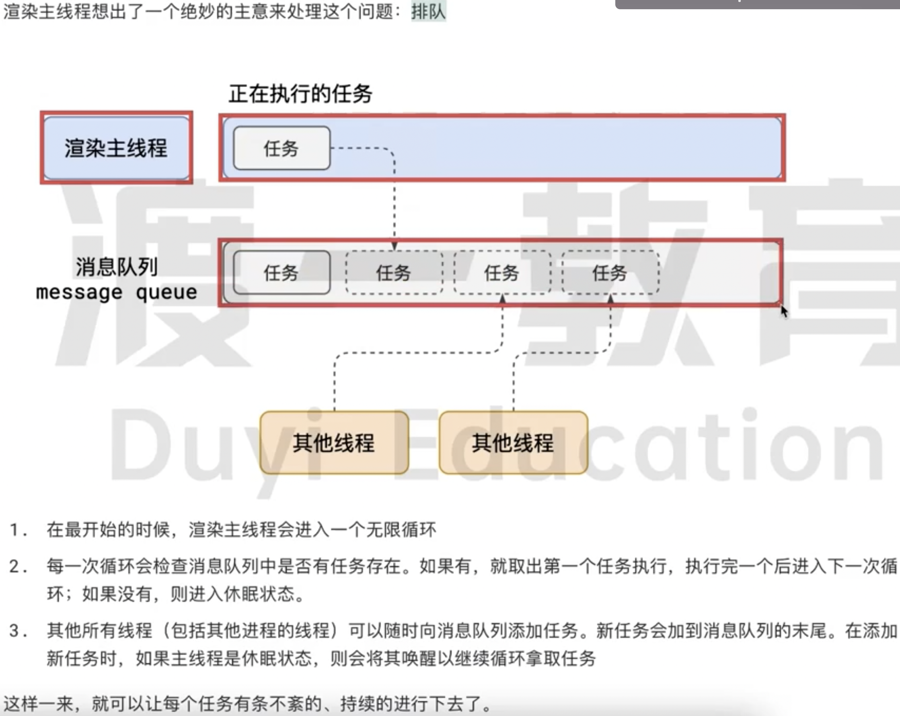
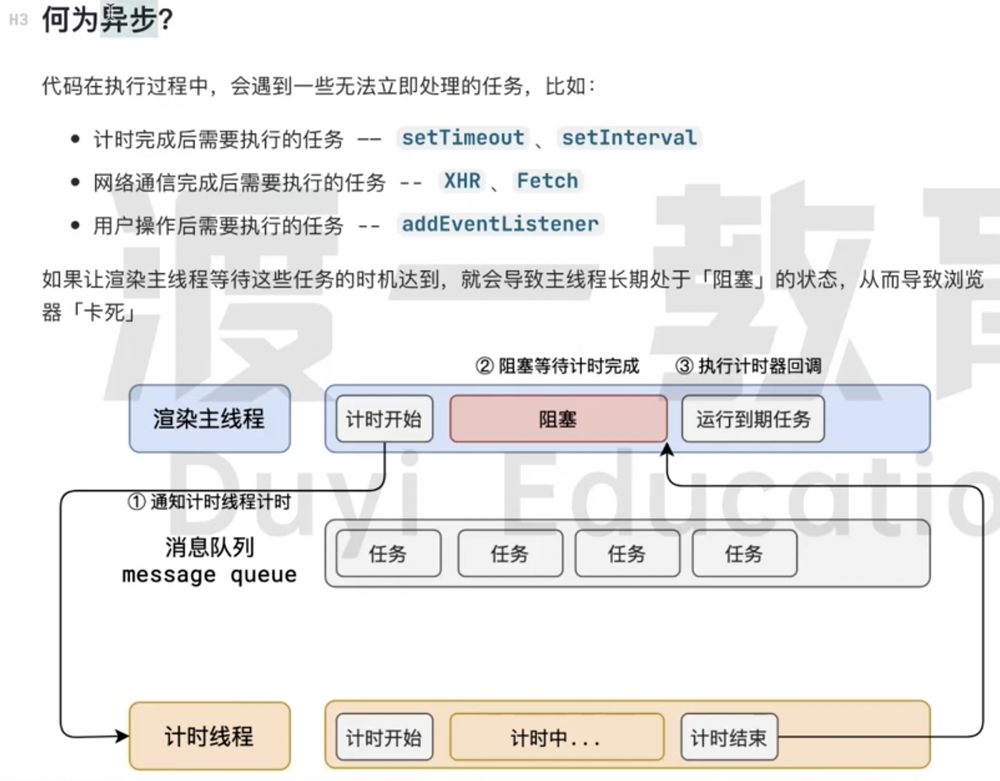
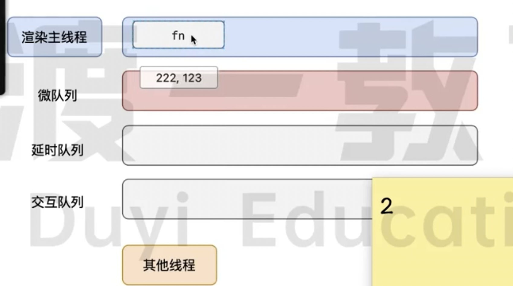

> ### 浏览器的进程模型
>

- 何为进程

  程序运行需要专属的内存空间，可以把这块内存空间理解为进程。

  每个应用至少有一个进程，进程之间相互独立，即使要通信，也需要双方同意。

- 何为线程

  一个进程至少有一个线程，所以在进程开启后，会自动创建一个线程来运行代码，该线程成为主线程。

  如果程序需要**同时**执行多块代码块，主线程会启动更多的线程执行代码，一个进程又包含多个线程。

> #### 浏览器有哪些进程和线程
>

- 浏览器是一个多进程，多线程的的应用程序。

- 浏览器有浏览器进程、网络进程、渲染进程（一个标签页一个渲染进程）
  1. 浏览器进程主要负责页面展示（图标、标签之类的展示）、用户交互（滚动、鼠标）、子进程管理。浏览器进程内部会启动多个线程处理不同的任务。
  2. 网络进程主要负责加载网络资源。网络进程内部会启动多个线程来处理不同的网络任务。
  3. 渲染进程启动后，会开启一个渲染的主线程，主程序负责执行 html、js、css代码。默认情况下，浏览器会为每个标签页开启一个新的渲染进程。以保证不同的标签页之间互不影响。

> #### 渲染主线程是如何工作的
>

渲染主线程是浏览器中最繁忙的线程，需要它处理的任务包括但不限于：

- 解析HTML
- 解析CSS
- 计算样式
- 布局
- 处理图层
- 每秒把画面画60次
- 执行全局JS代码
- 执行事件处理函数
- 执行计时器处理函数

> #### 一个线程如何调度以上任务？
>

渲染主程序：排队。任务队列。

> #### 何为异步
>

> #### JS为何会阻碍渲染
>

